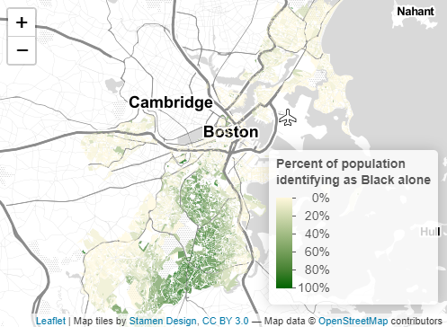
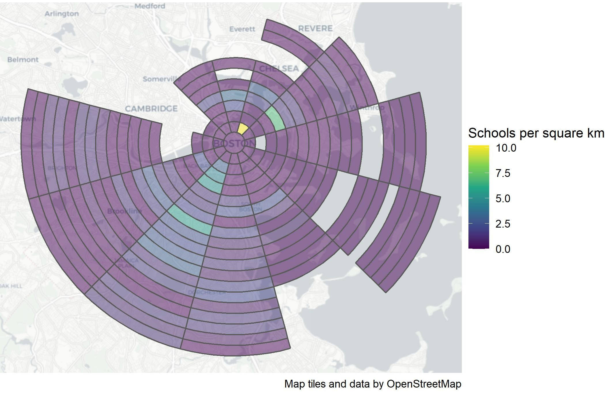
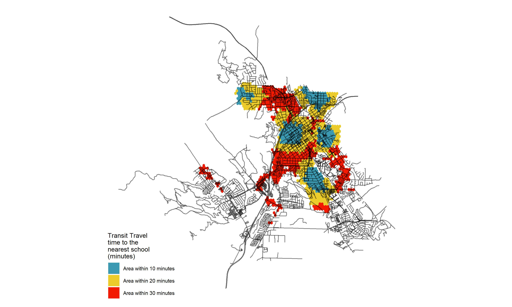
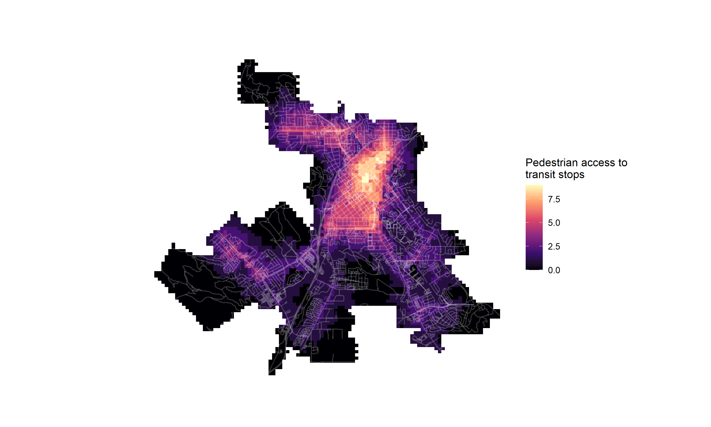

```{r setup, include=FALSE}
knitr::opts_chunk$set(echo = TRUE)
```

# Welcome

##Hello there! This site is in progress.

You've stumbled on Liz Cormack's first semester exploration of spacial visualization at the Harvard Graduate School of Design in Boston, Massachusetts. The majority of the work here was conducted in VIS 2127: Spacial Analysis with Professor Carole Voulgaris, a transportation planner whose work explores how people decide to travel through cities and why, and how the planning field uses quantitative data to influence that behavior. 

This is the very beginning of my journey with these concepts, including R, mapping, and thinking about design in three-dimensional space and place. If you have any questions, get in touch at lizcormack[at]gsd.harvard.edu. 

# Maps of Boston
Here are two maps of Boston. I might include some text here about this set of maps.

## Interactive Map
This interactive map demonstrates the following skills: 

* Displaying data on an interactive map

[](https://lizcormack.github.io/vis-portfolio//fullsize/inter_black.html){target="_blank"}

## Clockboard Map
This map demonstrates the following skills:

* Aggregating point data to a layer of polygons

[](https://lizcormack.github.io/vis-portfolio//fullsize/clockboard.pdf){target="_blank"}

# Maps of San Luis Obispo
Here are two maps of San Luis Obispo, California. I might include some text here as well.

## Isochrones
This map shows isochrones based on transit travel times to the nearest school. It demonstrates the following skills:

* Displaying multiple vector layers on the same map
* Calculating and displaying accessibility, based on travel time

[](https://lizcormack.github.io/vis-portfolio//fullsize/SLO_schools.pdf){target="_blank"}

## Accessibility
This map shows accessibility based on a distance-decay function of the walking time to the nearest transit stop. It demonstrates the following skills:

* Displaying multiple vector layers on the same map
* Calculating and displaying accessibility, based on travel time
* Displaying raster data on a map

[](https://lizcormack.github.io/vis-portfolio//fullsize/SLO_transit.pdf){target="_blank"}
