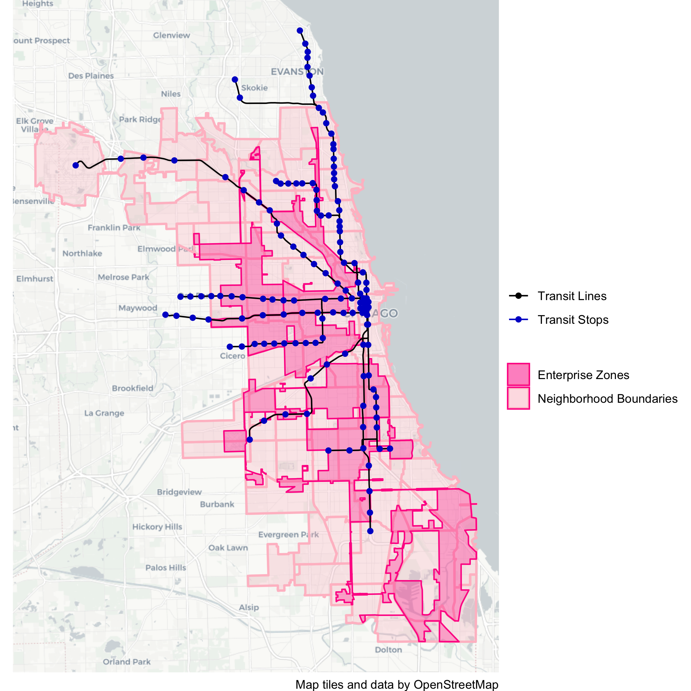
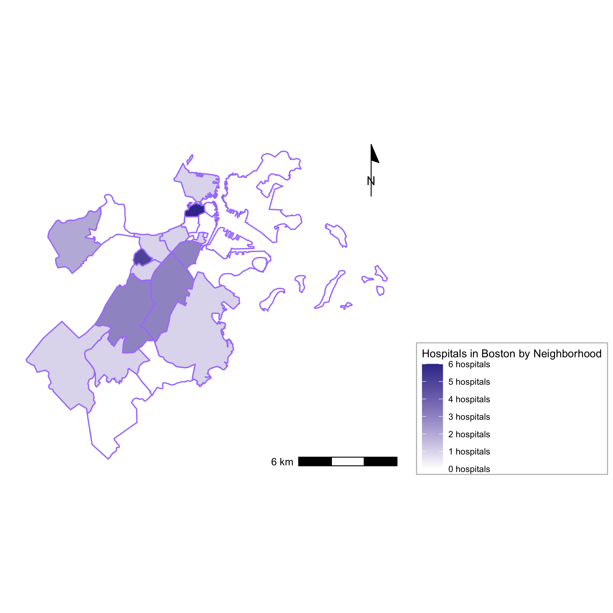
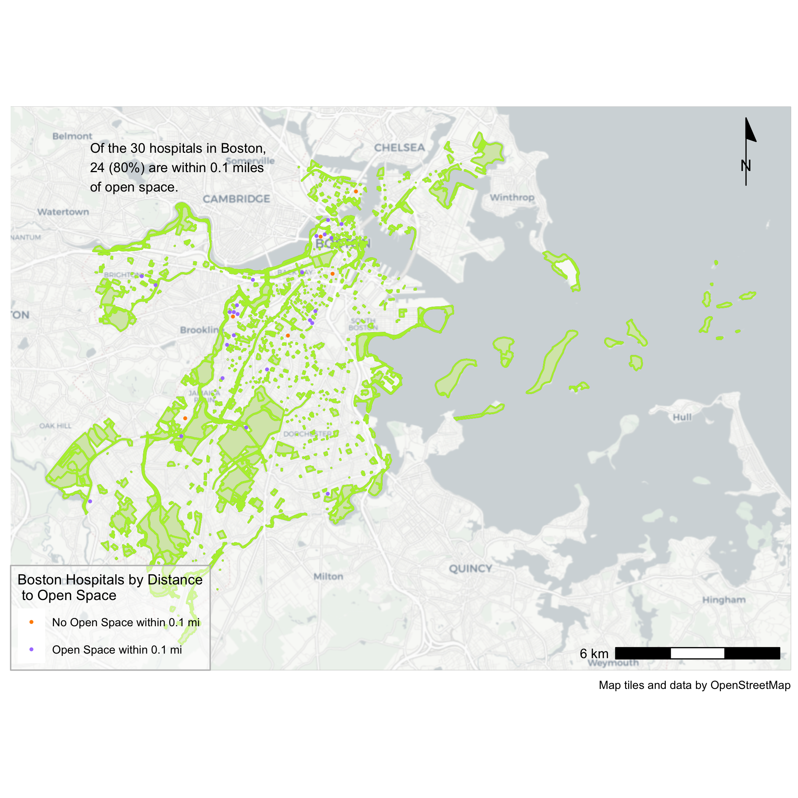
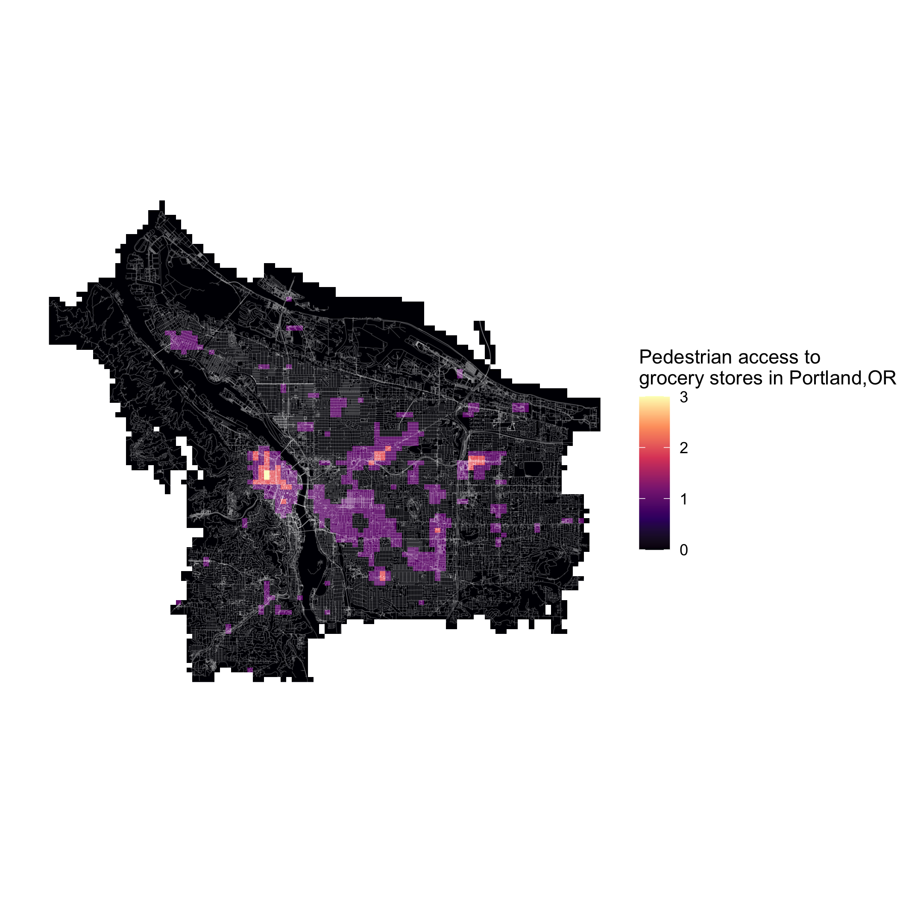
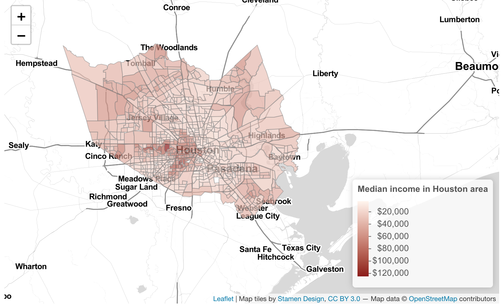

```{r setup, include=FALSE}
knitr::opts_chunk$set(echo = TRUE)
```

# Hello There!

You've stumbled on Liz Cormack's first semester exploration of spacial visualization at the Harvard Graduate School of Design in Boston, Massachusetts. The majority of the work here was conducted in VIS 2127: Spacial Analysis with [Professor Carole Voulgaris.](https://www.gsd.harvard.edu/person/carole-voulgaris/)

This is the very beginning of my journey with these concepts, including R, mapping, and thinking about design in three-dimensional space and place. If you have any questions, get in touch at lizcormack[at]gsd.harvard.edu. 

# Georeferencing
Georeferencing is the process of adding geographic coordinate data to a raster image, such as a scanned map, so that it appears in the correct place in a GIS tool. Using ArcGIS, we georeferenced maps from the fabulous [Harvard Map Collection.](https://library.harvard.edu/libraries/harvard-map-collection)

## Seoul, South Korea
In 1899, the first railroads in South Korea were built, connecting Seoul to the surrounding region with modern speed. This map, created a year later, shows Seoul on the cusp of major transformation that would quadruple the city's size and extend it beyond the Han river in the south.

[](https://lizcormack.github.io/vis-portfolio//fullsize/Georeference_Seoul.pdf){target="_blank"}

# Exploring Point + Polygon Data

## Chicago Transit Access
The Chicago Enterprise Zones program offers state and local tax incentives to encourage companies to locate their business in depressed areas of the city. The program aims to stimulate economic and neighborhood growth in six designated zones. Exploring these zones through a transportation lens reveals a substantial gap in transportation investment in these zones that could limit the potential of the City’s investment in the program.

As the visualization below illustrates, many of these zones are located in regions of the city with limited or no transit stops. For example, Zone 3, on the South Side of Chicago, one of the largest Enterprise Zones identified in the program, is not connected to any transit stop on Chicago’s ‘L’ line. The City of Chicago’s Enterprise Zones program must consider transit access in the six zones in order to be effective.

[](https://lizcormack.github.io/vis-portfolio//fullsize/chicagoTransit.png){target="_blank"}

## Boston Hospital Density
Boston is a world capital of medicine, and it was intersting to look at the distribution of its 30+ hospitals. Hospitals in Boston appear to exist in dense clusters, and are absent from some Boston neighborhoods, most notably East Boston, which is also separated from the Boston mainland and can only access hospitals via a few tunnels.

[](https://lizcormack.github.io/vis-portfolio//fullsize/hospitalDensity.pdf){target="_blank"}

## Boston Hospital Proximity to Open Space
After exploring hospital density, our group wanted to assess how many Boston hospitals were within short walking distance of open space, an emerging factor in health and recovery. By creating a 0.1 mile buffer around the open space polygons, then measuring how many hospitals fell within that buffer, were discovered that most Boston hospitals are within close proximity to open space. Further analysis might evaluate the quality of that open space, and what percentage of hospital patients have a 'direct line of sight' to greenery, which recent studies have found improves recovery time.

[](https://lizcormack.github.io/vis-portfolio//fullsize/bostonOpenspace.pdf){target="_blank"}

# Accessibility & Interaction

## Accessibility Map
An accessibility map depicts the number of options of a given resource (like grocery stores) within a certain travel radius. When we explored multiple ways of visualizing pedestrian access to grocery stores, including travel time matrix and isochrone maps of walking distance, they visualized the same data, but to very different effect. This accessibility map highlights the limited pedestrian access to grocery stores in the city quite clearly.

[](https://lizcormack.github.io/vis-portfolio//fullsize/portlandGrocery.pdf){target="_blank"}

## Interactive Map
Our final project for this course was to create an interactive map using U.S. Census Data. It was fascinating to explore the wealth of census data available (from the 2010 census, since the 2020 data is not yet accessible via R). As a UX Design by training, I'm really looking forward to further exploring the power of interactive maps to inspire and pursuade. Click the image below to open the interactive map.

[](https://lizcormack.github.io/vis-portfolio//fullsize/houston_income.html){target="_blank"}

## Thanks for reading!